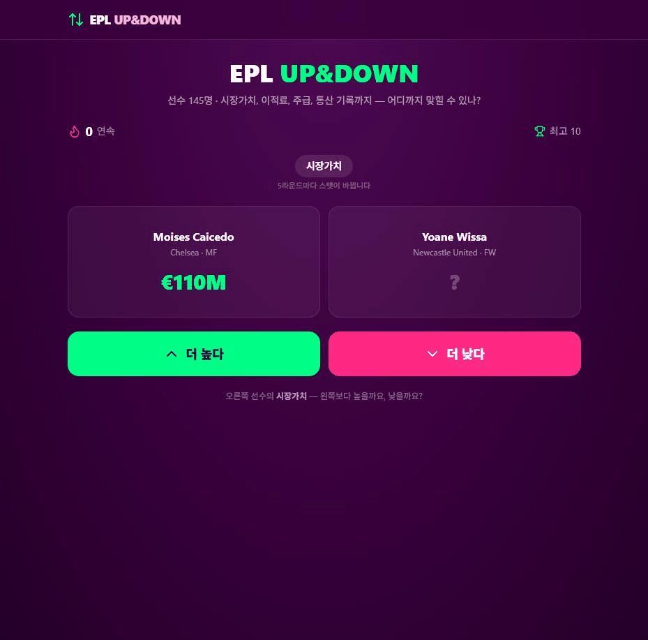

# ⚽ EPL UP&DOWN

두 프리미어리그 선수의 기록을 비교해 **더 높은지 / 더 낮은지** 맞히는 업다운 게임. 몇 연속까지 갈 수 있나?

**🔗 [https://epl-quiz.vercel.app](https://epl-quiz.vercel.app)**



## 규칙

왼쪽 선수의 값이 공개되고, 오른쪽 선수의 값은 가려져 있습니다. 오른쪽이 더 높은지 낮은지 고르면 됩니다. 하나라도 틀리면 종료, 연속 기록이 점수입니다.

**맞히면 그 선수가 왼쪽으로 넘어와 다음 라운드의 기준이 됩니다.** 사슬처럼 이어지다가 5라운드마다 스탯이 바뀌면서 기준이 새로 잡힙니다.

| 스탯 | 단위 |
| --- | --- |
| 시장가치 | €M |
| 최고 이적료 | €M |
| 주급 | £k |
| PL 통산 골 | 골 |
| PL 통산 출전 | 경기 |
| 한 시즌 최다 골 | 골 |
| 한 시즌 최다 도움 | 도움 |

- **정답이 뻔한 조합은 출제되지 않습니다** — 자유이적(€0) 선수의 이적료 라운드, 골키퍼의 통산 골 라운드 등은 후보에서 제외.
- **난이도 보정** — 기준값 대비 배율로 후보를 뽑습니다. 팽팽(1.12~1.6배) 33% / 보통(1.6~2.8배) 48% / 여유(2.8~6배) 18%. 거의 동급이라 찍어야 하는 라운드는 나오지 않습니다.
- **무승부 없음** — 두 값이 같으면 다른 선수로 교체해 항상 정답이 존재합니다.
- **연속 기록**은 브라우저(localStorage)에만 저장되며, 결과 화면에서 텍스트로 복사해 공유할 수 있습니다.
- **새로고침하거나 다시하기를 누를 때마다 완전히 새로운 조합**이 출제됩니다.
- **링크 미리보기 썸네일**(1200×630)은 `src/app/opengraph-image.tsx`에서 `next/og`로 생성됩니다. 한글은 서브셋 폰트(각 26KB)를 쓰며, 문구에 새 글자를 추가하면 `node scripts/build-og-font.mjs`로 폰트를 다시 받아야 합니다.

## 공유 썸네일

링크를 공유하면 뜨는 미리보기 이미지(1200×630). `src/app/opengraph-image.tsx`에서 `next/og`로 생성됩니다.


## 선수 데이터

현역 선수 + 리그 레전드 **145명**. **2026-27 시즌 개막 기준**으로 소속팀·이적료·통산 기록을 검수했습니다. 프리미어리그를 떠난 선수(살라·로드리·왓킨스 등)와 강등 팀 소속 선수도 비교 대상으로 남겨뒀습니다.

정답이 뻔해지는 값(자유이적 €0, 무소속 선수의 주급 0, 골키퍼의 통산 골 등)은 해당 스탯 라운드에서 자동 제외됩니다.

```jsonc
{
  "id": "haaland",
  "name": "Erling Haaland",
  "team": "Manchester City",   // 은퇴 선수는 "레전드"
  "nationality": "Norway",
  "position": "FW",            // GK | DF | MF | FW
  "age": 25,
  "marketValue": 180,          // 현재(은퇴 선수는 전성기) 추정 시장가치, €M
  "transferFee": 60,           // 커리어 최고 이적료, €M
  "weeklyWage": 525,           // 주급, £k
  "plGoals": 105,              // PL 통산 골
  "plApps": 130,               // PL 통산 출전
  "bestSeason": { "season": "2022-23", "goals": 36, "assists": 8 }
}
```

> 수치는 공개 자료 기반의 **근사치**이며 게임용입니다. 정확한 기록은 공식 출처를 확인하세요.

## 기술 스택

Next.js 16 (App Router) · TypeScript · Tailwind CSS v4 · Framer Motion · Lucide Icons

## 실행

```bash
npm install
npm run dev        # http://localhost:3000
npm run build
node scripts/check-players.mjs   # 데이터셋 + 출제 로직 자체 점검
```

## 구조

```
src/
  app/page.tsx            # 게임 화면 (단일 페이지)
  app/opengraph-image.tsx # 공유 썸네일 (OG 이미지, 1200x630)
  components/
    EplHeader.tsx         # 헤더
    UpDownGame.tsx        # 게임 본체
    ResultModal.tsx       # 결과 모달 + 클립보드 공유
  lib/
    quiz.ts               # 순수 로직: 스탯 정의, 라운드 생성, 공유 텍스트
    players.ts            # 데이터 로딩
  data/epl_players.json   # 선수 145명
  app/fonts/              # 썸네일용 한글 서브셋 폰트
scripts/check-players.mjs # assert 기반 자체 점검
scripts/build-og-font.mjs # 썸네일 폰트 서브셋 다운로드
docs/demo.gif             # README용 플레이 화면 녹화
```

## 배포

Vercel CLI로 배포합니다 (Git 연동은 아직 없음).

```bash
npx vercel --prod
```

## 로드맵

- [ ] 선수 사진 / 클럽 로고
- [ ] 글로벌 리더보드 (Supabase)
- [ ] 일일 고정 시드 챌린지 (같은 문제로 전 세계 랭킹)

## 라이선스

[MIT](./LICENSE)
